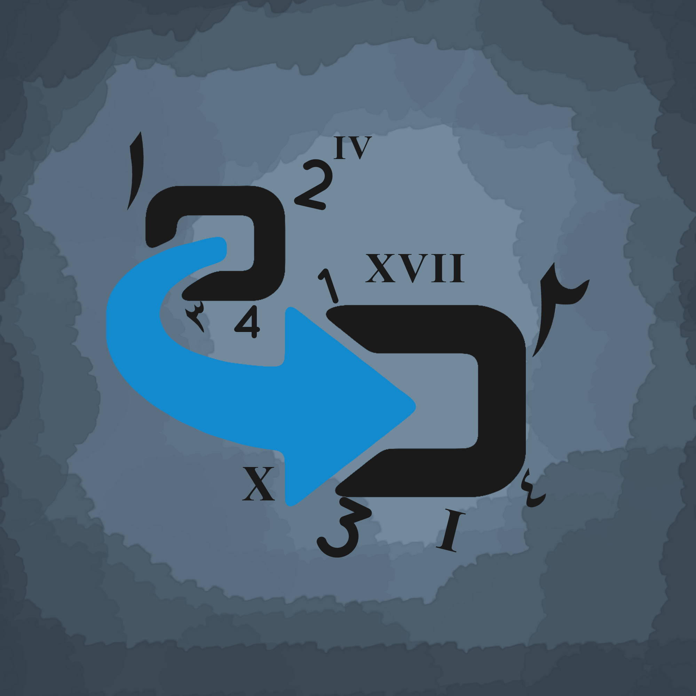

# NUMERAL SYSTEMS - converts numbers by numerals system types ..

---



[![Build Status][travis-img]][travis-url]
[![Coverage Status][coverage-img]][coverage-url]
[![NPM version][npm-badge]][npm-url]
[![License][license-badge]][license-url]
![Code Size][code-size-badge]

<!-- ***************** -->

[travis-img]: https://travis-ci.org/3imed-jaberi/numeral-systems.svg?branch=master
[travis-url]: https://travis-ci.org/3imed-jaberi/numeral-systems
[coverage-img]: https://coveralls.io/repos/github/3imed-jaberi/numeral-systems/badge.svg?branch=master
[coverage-url]: https://coveralls.io/github/3imed-jaberi/numeral-systems?branch=master
[npm-badge]: https://img.shields.io/npm/v/numeral-systems.svg?style=flat
[npm-url]: https://www.npmjs.com/package/numeral-systems
[license-badge]: https://img.shields.io/badge/license-MIT-green.svg?style=flat-square
[license-url]: https://github.com/3imed-jaberi/numeral-systems/blob/master/LICENSE
[code-size-badge]: https://img.shields.io/github/languages/code-size/3imed-jaberi/numeral-systems

<!-- ***************** -->

#### The purpose of this module is to convert any type of numbers to other type you want.

> Note: the package is lightweight but the attached picture is what makes the unit reach more than 400kb ..

## `Installation`

```bash
# npm
$ npm install numeral-systems
# yarn
$ yarn add numeral-systems
```

## `Usage`

This is a practical example of how to use.

```javascript
const numeralSystems = require("numeral-systems");
const result = numeralSystems("2019", "Arabic");

console.log(result);
// ۲۰۱۹
```

#### **`NOTE:`** In case the number is a modern type, you can enter the number to the function in number type like this;

```javascript
const numeralSystems = require("numeral-systems");
const result = numeralSystems(2019, "Arabic"); // 2019 not '2019'

console.log(result);
// ۲۰۱۹
```

###### You can check the test folder for all possible cases.

## `Some Informations`

In this module we have 7 numerals systems. You can convert between them ..

- Arabic : ٠ , ١ , ٢ , ٣ , ٤ , ٥ , ٦ , ٧ , ٨ , ٩ , ١٠ ...
- Khmer : ០ , ១ , ២ , ៣ , ៤ , ៥ , ៦ , ៧ , ៨ , ៩ ...
- Lao : ໐ , ໑ , ໒ , ໓ , ໔ , ໕ , ໖ , ໗ , ໘ , ໙ ...
- Modern : 1 , 2 , 3 4 , 5 , 6 , 7 , 8 , 9 , 10 ...
- Persian : ٠ , ١ , ٢ , ٣ ,۴, ۵ , ۶ , ٧ , ٨ , ٩ , ١٠ ...
- Romain ( Romain IN [ 1 .. 3999] ) : I , II , III , IV , V , VI , VII , VIII , IX , X ...
- Thai : ๐ , ๑ , ๒ , ๓ , ๔ , ๕ , ๖ , ๗ , ๘ , ๙ ...

**`NOTE:`** Al-Khwarizmi put the modern numeral system for that is considered the original Arabic and this for the scientific secretariat, but we relied on the Arabic numerals very old under the name "Arabic" and the numerls system developed by Al-Khwarizmi "modern" ...

#### `License`

---

[MIT](LICENSE) &copy; [Imed Jaberi](https://github.com/3imed-jaberi)
